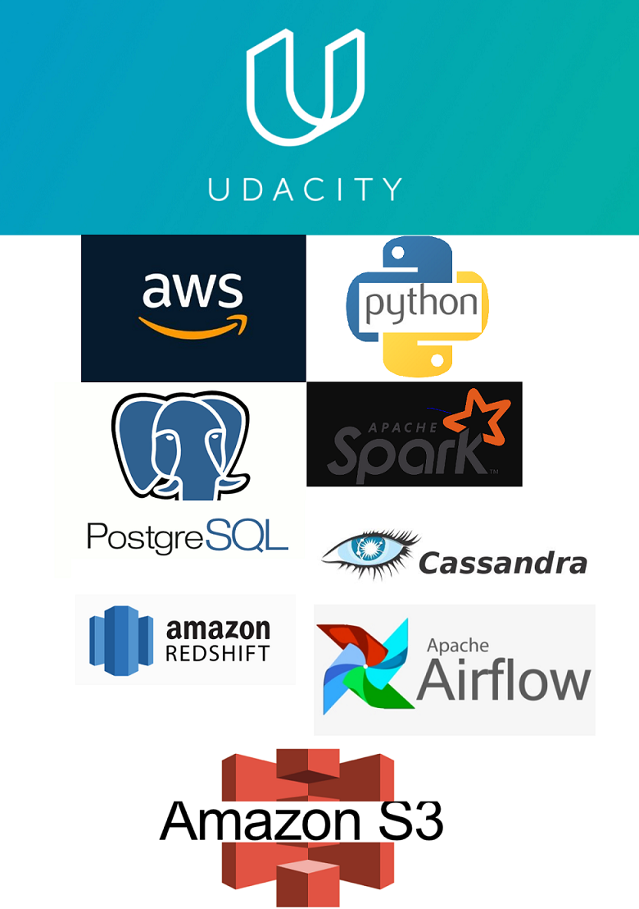
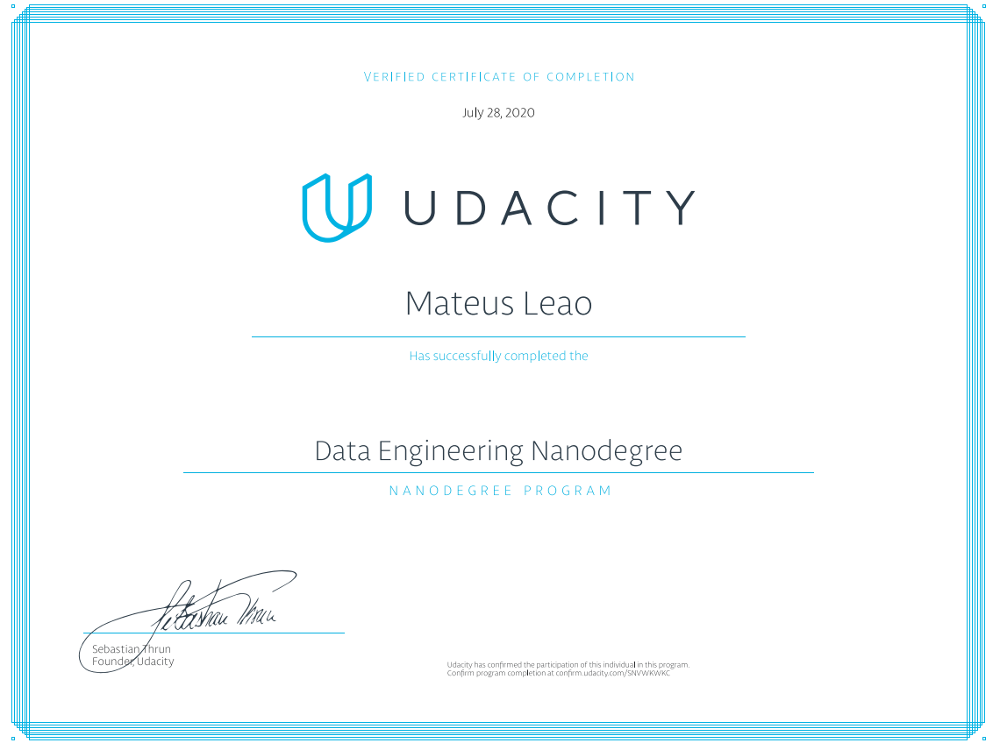

# Data Engineer NanoDegree -
### Used Technologies: Python, AWS, Postgres, Cassandra, S3, Redshift (Warehouse), Data Lakes in S3 & Airflow

This repository contains projects developed through the Data Engineering Nanodegree offered by Udacity.
Most of them utilize Python to set-up applications where we can do the Engineering work, usually capturing, transforming, and storing data with different architectures.

### The Projects worked:
<b>Project 1)</b> In the first project we worked with PostgreSQL, designing the star-schema of a dataset, and inserting data into our Dimensions and Fact table using a Python Application.  
<b>Project 2)</b> Here we used Apache Cassandra to define our data schema, we made different queries according to the queries we wanted to do. Cassandra is a columnar database.  
<b>Project 3)</b> Worked with AWS (Redshift and S3) and Python to create an ETL. Our work creates the IAM Credentials, create the Redshift Cluster using code, we also had to open a VPC port in our VPC (Network), so we can access the redshift cluster endpoint. In the end we delete the cluster so it won't consume resources.  
<b>Project 4)</b> In project 4 we used s3 as a data lake, and spark to process our data and store it back in S3.  
<b>Project 5)</b> Airflow is the king here, we used Airflow to implement a Data Pipeline (ETL).  

### And the certificate:

